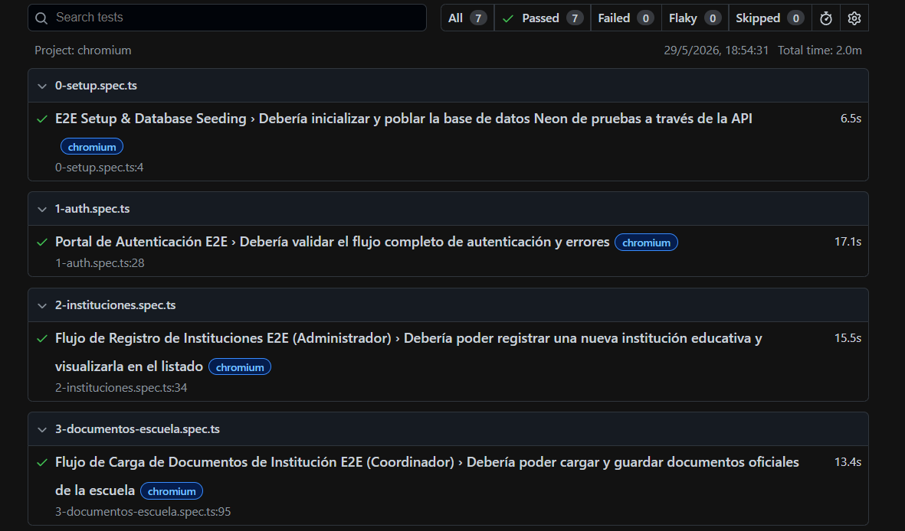
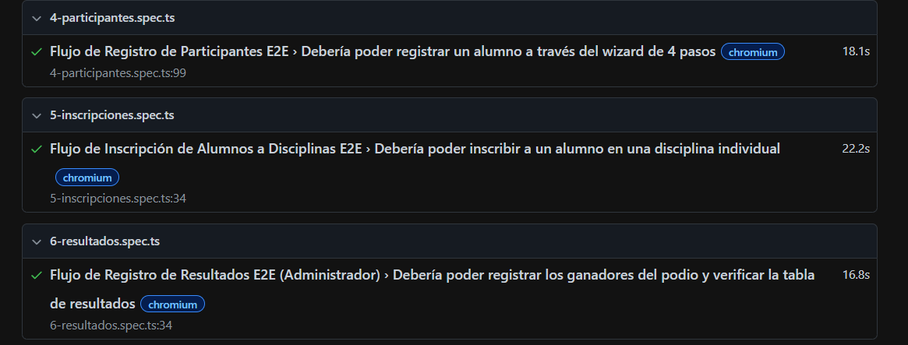

# INTEGRANTES

Aldo Noe Pacheco Gaona
Axel Yael Zambrano Flores
Jose Ivan Silva Espinoza
David Maldonado Barajas

# Sistema ENIEP 2026 - Plataforma de Gestión Deportiva y Cultural

Este proyecto consiste en el Sistema de Gestión E2E para el **ENIEP (Encuentro Nacional de Interprepas Federales por Cooperación)**. Incluye una landing page pública con animaciones de alto nivel, portal de registro escolar, gestión de participantes con asistentes interactivos, inscripciones a disciplinas y control de podios y medalleros en tiempo real.

---

## 🛠️ Requisitos de Entorno e Instalación

1. **Instalar Dependencias:**
   ```bash
   pnpm install
   ```

2. **Configuración de Variables de Entorno (.env):**
   Copia el archivo de ejemplo e ingresa tus claves de Firebase Storage y base de datos locales o de desarrollo:
   ```bash
   cp .env.example .env
   ```

3. **Iniciar Servidor de Desarrollo:**
   ```bash
   pnpm dev
   ```
   La aplicación estará disponible en [http://localhost:3000](http://localhost:3000).

---

## 🎭 Suite de Pruebas E2E (Extremo a Extremo)

Hemos diseñado e implementado una suite completa de pruebas E2E robusta y profesional para asegurar la calidad de la plataforma.

### 🧰 Herramienta Utilizada
* **Playwright Framework** (con TypeScript).
* Configurada para ejecutarse en Chromium y con soporte para reportes visuales en HTML interactivo.

### 🧪 Configuración de Base de Datos de Pruebas e Aislamiento
Las pruebas corren de forma aislada y segura utilizando la variable `DATABASE_URL` y variables de Firebase específicas configuradas en [.env.test]. Esto asegura que no se alteren ni contaminen datos de producción.

---

## 📋 Descripción de los 6 Flujos Automatizados

La suite ejecuta 7 archivos de pruebas de forma ordenada y secuencial (`workers: 1`) para mantener la integridad de estados lógicos:

1. **Flujo de Seeding Inicial (`0-setup.spec.ts`):**
   * Dispara el endpoint local `/api/seed-e2e` para resetear estados lógicos anteriores y sembrar de forma limpia el usuario Administrador (`admin_test`), el Coordinador de Plantel (`prueba`), escuelas base y disciplinas del torneo.
2. **Flujo 1: Autenticación y Cierre de Sesión (`1-auth.spec.ts`):**
   * Valida flujos de credenciales inválidas (Better Auth), acceso a restablecimiento de contraseña, inicio de sesión exitoso y cierre de sesión seguro regresando a la landing page pública.
3. **Flujo 2: Registro de Planteles / Instituciones (`2-instituciones.spec.ts`):**
   * Automatiza el registro de una nueva institución educativa con CCT único autogenerado y datos de director, validando su posterior visualización y filtrado en la sección de planteles.
4. **Flujo 3: Carga de Documentos Escolares (`3-documentos-escuela.spec.ts`):**
   * Un Coordinador institucional inicia sesión, navega a la sección de expediente escolar y sube documentos oficiales obligatorios ("Aval de Presidencia" y "Liberación de Adeudos") usando PDFs simulados.
5. **Flujo 4: Registro wizard de Participantes (`4-participantes.spec.ts`):**
   * Automatiza el flujo de registro de un alumno en un formulario modular de 4 pasos (Datos personales, Fotografía recortada, Antecedentes médicos y Tutor Legal), adjuntando su documentación y verificando su alta en la lista de alumnos activos.
6. **Flujo 5: Inscripción a Disciplina y Categorías (`5-inscripciones.spec.ts`):**
   * Inscribe al participante recién creado en la disciplina *Oratoria Única* (Individual / Categoría Única), validando el bloqueo de duplicados y su aparición en la tabla de participantes inscritos.
7. **Flujo 6: Registro de Resultados y Podium (`6-resultados.spec.ts`):**
   * Permite al Administrador registrar a los ganadores (Oro, Plata y Bronce) en competencias finalizadas y corrobora que la medalla sea reflejada instantáneamente en el medallero global interactivo de la plataforma.

---

## 🚀 Instrucciones de Ejecución de Pruebas

Para correr la suite de pruebas E2E y ver los reportes:

1. **Poblar Base de Datos de Prueba (Seeding manual opcional):**
   ```bash
   node scripts/seed-e2e.js
   ```
2. **Ejecutar Pruebas E2E en Consola (Headless):**
   ```bash
   npx playwright test
   ```
   *El servidor de desarrollo Next.js se iniciará automáticamente de forma aislada y con variables de prueba, apagándose al terminar la suite.*
3. **Ejecutar en Modo UI Visual:**
   ```bash
   npx playwright test --ui
   ```
4. **Ver Reporte HTML Detallado:**
   ```bash
   npx playwright show-report
   ```

---
## 🏆 Evidencia de Ejecución de las Pruebas

